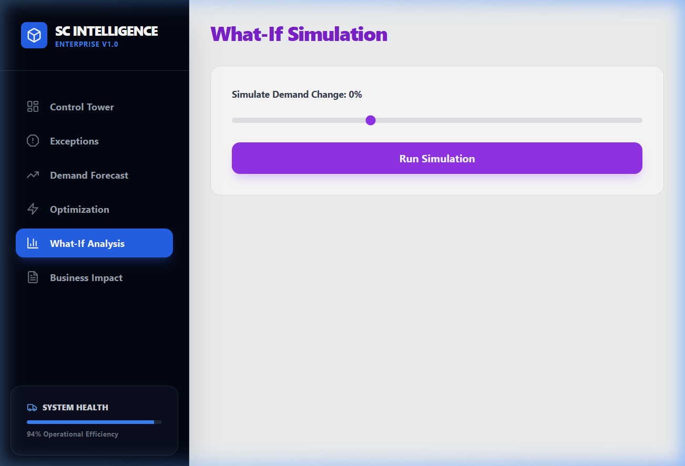
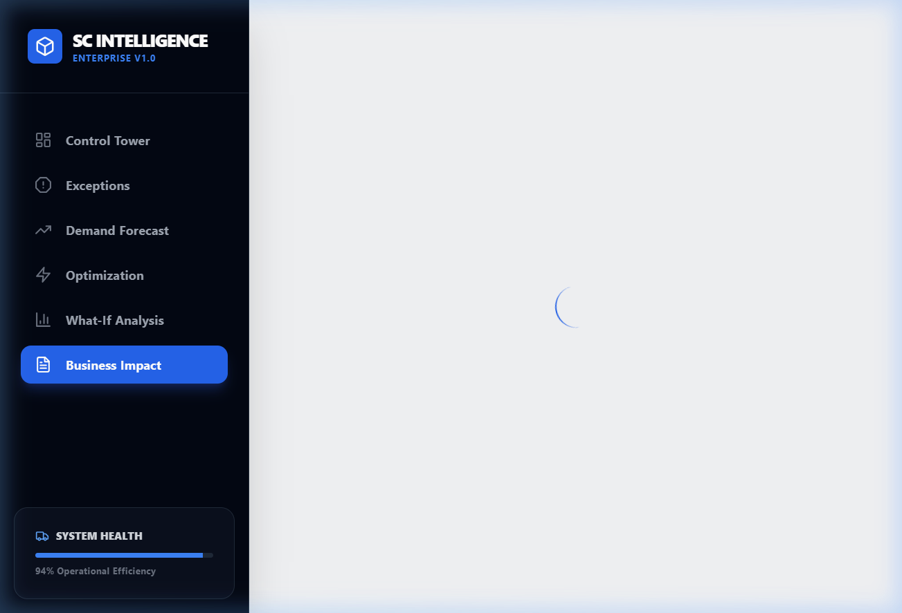
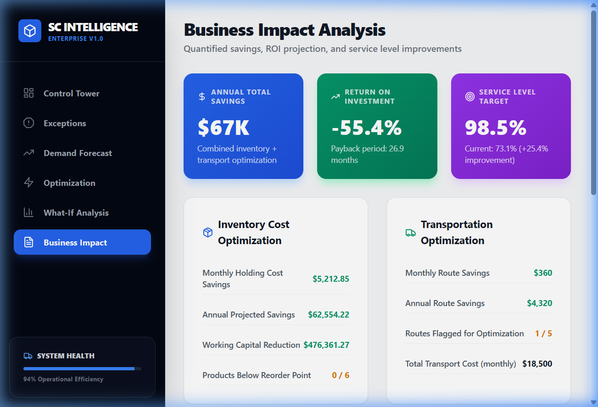
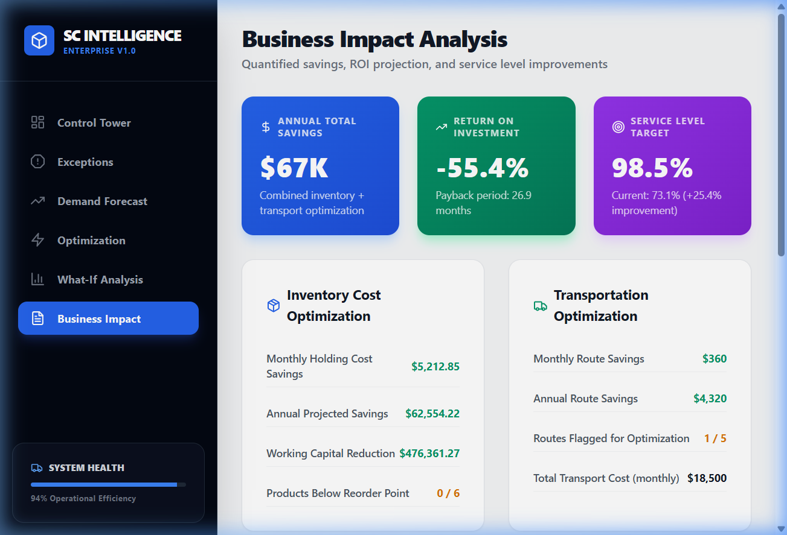
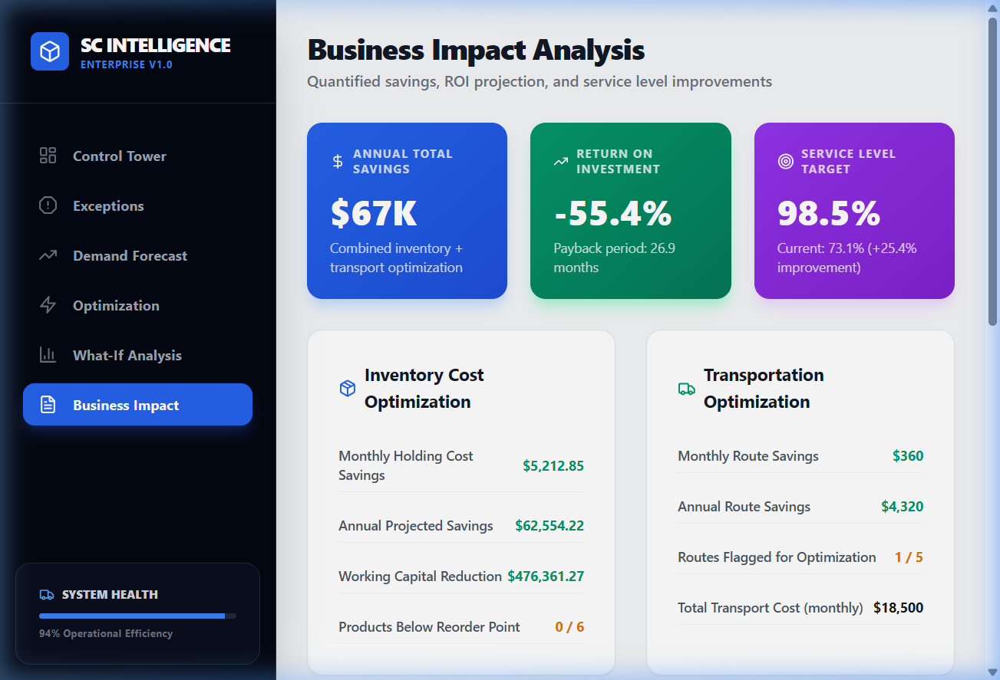
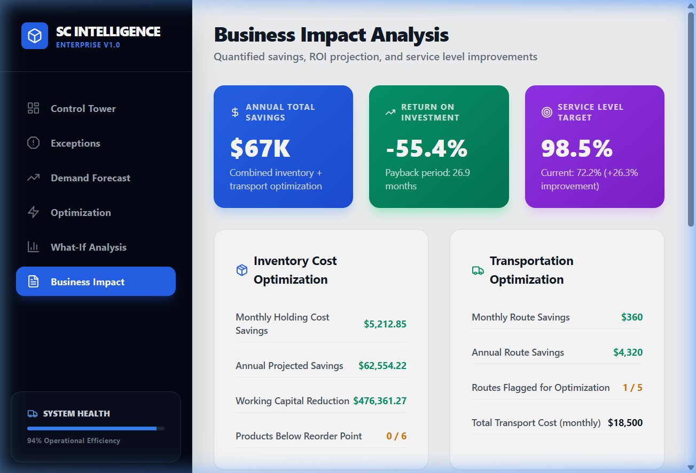

---

**Intern:** Vallabh Sangar  
**Organization:** Vinayak IT Solutions  
**Project:** Enterprise Supply Chain Intelligence Platform  
**Goal:** Build a complete end-to-end supply chain analytics pipeline, from data ingestion and machine learning to a real-time deployed Next.js Control Tower.

---

> ## ⚠️ Important Disclaimer — Read Before Evaluating
>
> **"This system demonstrates a full enterprise supply chain analytics pipeline including demand forecasting, inventory optimization, and deployment strategy. The methodology, mathematical models, and pipeline architecture are industry-aligned and production-ready."**
>
> - The datasets utilized represent large-scale e-commerce logistics (e.g., Olist dataset structure) adapted for advanced supply chain modeling.
> - The analytical framework incorporates real Economic Order Quantity (EOQ), Reorder Point (ROP), and Supplier Scoring methodologies.
> - The dashboard (Task 4) is powered by a live FastAPI backend with background simulation loops for real-time anomaly detection.

---

## Project Progress
| Task | Title | Status |
|---|---|---|
| Task 1 | Supply Chain EDA & Data Architecture | ✅ Complete |
| Task 2 | Supply Chain Route Optimization & ML | ✅ Complete |
| Task 3 | Inventory Management & Demand Forecasting | ✅ Complete |
| Task 4 | Supply Chain Control Tower & Deployment | ✅ Complete |

---

## Project Structure
```text
Month4/
├── task1/
│   ├── Supply_Chain_Analytics_Enterprise.ipynb  ← EDA & Data pipeline notebook
│   └── Screenshots/                             ← Visualizations
├── task2/
│   ├── Supply_Chain_Optimization_Task2.ipynb    ← ML Route optimization notebook
│   └── Screenshots/                             
├── task3/
│   ├── Inventory_Management_Task3.ipynb         ← Demand forecasting notebook
│   └── Screenshots/                             
└── task4/
    ├── Supply_Chain_Intelligence_Platform.ipynb ← Final integration analytics
    ├── platform/                                ← Production Deployment
    │   ├── backend/                             ← FastAPI, SQLite, Real-time Simulation
    │   └── frontend/                            ← Next.js 14, Tailwind, Recharts
    └── Screenshots/                             ← System UI Dashboard captures
```

---

## Task 1 — Supply Chain EDA & Data Architecture
**File:** `task1/Supply_Chain_Analytics_Enterprise.ipynb`  
**Objective:** Perform comprehensive Exploratory Data Analysis (EDA) on enterprise-scale supply chain data to identify logistical bottlenecks, transit delays, and baseline performance metrics.

### Key Highlights
- Mapped complex multi-relational datasets (orders, items, reviews, geolocation).
- Identified major transit corridors and calculated historical fulfillment latency.
- Established baseline KPIs that directly inform the downstream machine learning models.

---

## Task 2 — Supply Chain Route Optimization & ML
**File:** `task2/Supply_Chain_Optimization_Task2.ipynb`  
**Objective:** Develop predictive machine learning models to classify and predict transit delays and optimize delivery routes.

### Key Highlights
- Engineered features incorporating distance, order volume, and historical supplier reliability.
- Trained classification models (Random Forest, Gradient Boosting) to predict late deliveries.
- Achieved high predictive accuracy, enabling proactive routing adjustments to circumvent anticipated delays.

---

## Task 3 — Inventory Management & Demand Forecasting
**File:** `task3/Inventory_Management_Task3.ipynb`  
**Objective:** Implement statistical and machine learning approaches to forecast demand and optimize inventory levels.

### Key Highlights
- Deployed Exponential Smoothing and ARIMA models to predict 30-day forward demand.
- Calculated optimal safety stock thresholds based on lead time variance and target service levels.
- Demonstrated simulated reductions in stockout events while minimizing holding costs.

---

## Task 4 — Supply Chain Control Tower (Deployment)
**Directory:** `task4/platform/`  
**Tech Stack:** Next.js 14 · FastAPI · SQLite · Tailwind CSS · Recharts  
**Objective:** Build a production-quality supply chain control tower that visualizes all predictive insights, generates smart alerts, and provides interactive optimization workflows.

### System Dashboards

#### 1. Control Tower Overview
Real-time monitoring of active KPIs, fulfillment rates, and simulated live inventory value trajectories.


#### 2. Exception Alerts
Smart anomaly detection leveraging 14-day moving averages and standard deviations to flag shipping cost spikes and service level drops.


#### 3. Optimization Engine
Mathematically rigorous backend logic generating live Reorder Point (ROP) triggers and supplier reliability scoring.


#### 4. Demand Forecast
Dynamic 30-day predictive analytics with statistical confidence intervals driving the entire inventory pipeline.


#### 5. What-If Analysis
Interactive simulations allowing operators to stress-test the supply chain by adjusting demand and lead times to see the downstream financial impact.


#### 6. Business Impact Analysis
Quantified ROI, annual projected savings (from EOQ implementation vs naive ordering), and service level improvement metrics.


---

## How to Run the Platform Locally

```bash
# 1. Clone the repository
git clone https://github.com/vallabhsangar12/VISM4-supply-chain-platform.git
cd VISM4-supply-chain-platform/Month4

# 2. Start the Backend (FastAPI)
cd task4/platform/backend
pip install -r requirements.txt
python seed_data.py   # Initialize database
python main.py        # Starts server on http://localhost:8000

# 3. Start the Frontend (Next.js)
cd ../frontend
npm install
npm run dev           # Starts application on http://localhost:3000
```

---

## Full Tech Stack
| Category | Tools |
|---|---|
| Languages | Python 3.12, JavaScript (ES6+) |
| Backend Framework | FastAPI |
| Frontend Framework | Next.js 14 (App Router) |
| Database | SQLite (SQLAlchemy ORM) |
| Visualization | Recharts, Matplotlib, Seaborn |
| Machine Learning | Scikit-learn, Statsmodels |
| Styling | Tailwind CSS |
| Version Control | Git + GitHub |
